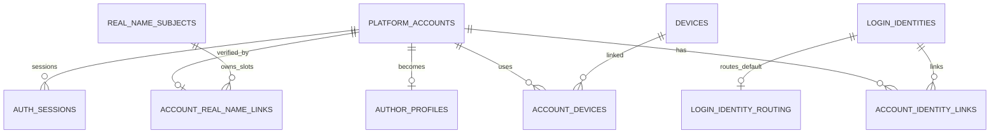
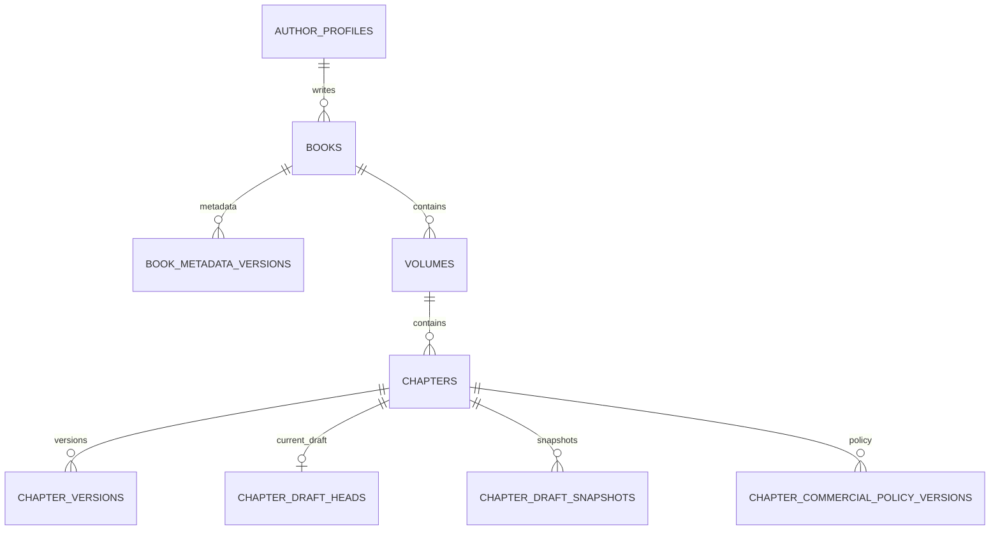
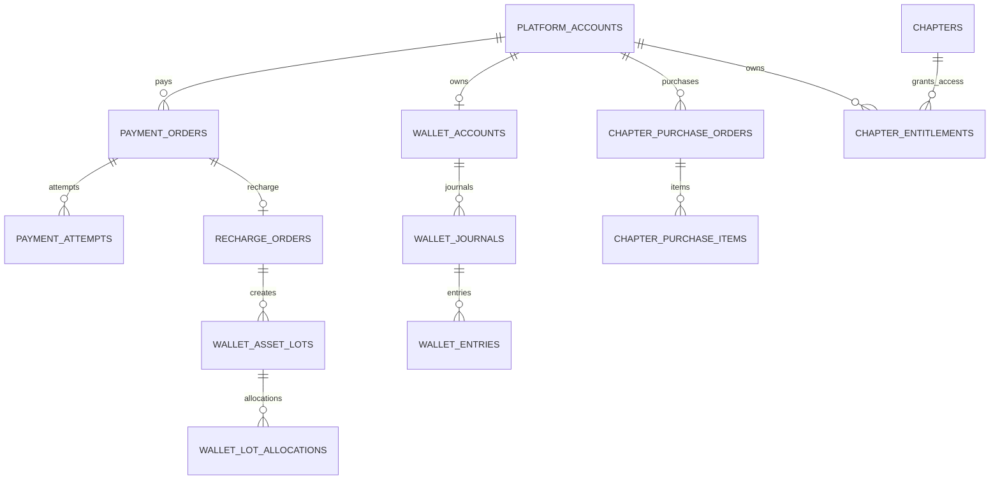
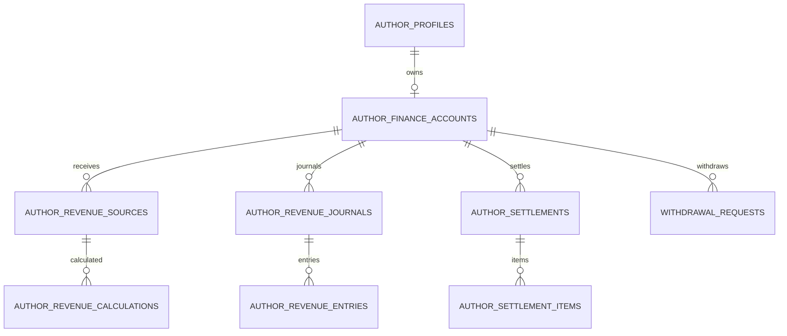
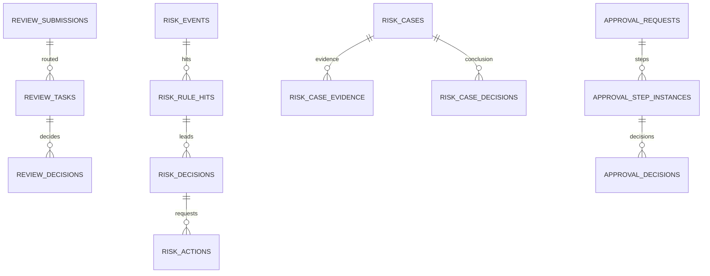

必要Approval
```

---

## 78. Legal Hold

Legal Case关联的数据：

```text
合同
支付
UGC
证据文件
```

进入 active Legal Hold 后：

```text
Retention Job不能删除
```

案件结束释放 Hold 后重新回到正常 Retention。

---

# 第五篇：统一 ER / 数据关系图

## 79. 身份 ER



---

## 80. 内容 ER



---

## 81. 支付/钱包/权益 ER



---

## 82. 作者收益 ER



---

## 83. Review / Risk / Approval ER



---

# 第六篇：数据库实现规范

## 84. 一个集群，Domain Schema

一期：

```text
一个 MySQL 8.4 Cluster
```

逻辑：

```text
novel_iam
novel_author
novel_content
novel_review
novel_reading
novel_library
novel_community
novel_membership
novel_commerce
novel_wallet
novel_author_finance
novel_contract
novel_copyright
novel_legal
novel_operation
novel_support
novel_risk
novel_platform
novel_audit
```

不是一期上 18 个数据库服务器。

---

## 85. ID

三类：

```text
Internal PK
Public Business ID
Third-party ID
```

Internal：

```text
BIGINT UNSIGNED
```

Public：

```text
account_no
book_no
chapter_no/public_id
payment_no
refund_no
case_no
approval_no
```

第三方：

```text
wechat_openid fingerprint/encrypted
qq_subject
wechat_payment_tx_id
alipay_tx_id
```

---

## 86. 跨域 FK

同 Domain：

```text
可以Physical FK
```

跨 Domain：

```text
默认不建Physical FK
```

例如：

```text
wallet_accounts.account_id
```

逻辑指向 IAM。

但禁止 Wallet Repository JOIN IAM 后直接改 IAM。

---

## 87. Ledger

WalletEntry：

```text
INSERT ONLY
```

RevenueEntry：

```text
INSERT ONLY
```

修改历史金额：

```text
禁止
```

更正：

```text
new REVERSAL / ADJUSTMENT entry
```

---

## 88. Wallet事务

一次消费：

```text
SELECT balance FOR UPDATE
↓
选择Lots
↓
Journal
↓
Entries
↓
LotAllocations
↓
Balance Projection
↓
COMMIT
```

必须是同一个 Wallet Transaction。

---

## 89. Wallet索引

Gift lot：

```text
(wallet_account_id, asset_type, status, expires_at, issued_at)
```

Recharge lot：

```text
(wallet_account_id, asset_type, status, issued_at)
```

Lot Allocation：

```text
(lot_id, allocation_type)
(journal_id)
```

---

## 90. Payment幂等

```text
payment_no UNIQUE
(channel, provider_event_id) UNIQUE
(channel, channel_transaction_id) UNIQUE when available
```

Payment回调重复：

```text
第二次直接返回已处理
```

不能第二次充值。

---

## 91. Entitlement

```text
UNIQUE(account_id, chapter_id)
```

这是防止重复永久权益的最后一道数据库防线。

---

## 92. 高并发 Reading

Raw Events 不长期塞 MySQL 主 OLTP。

目标：

```text
Reader Event
↓
MQ
↓
ClickHouse
↓
Validated Facts
```

一期过渡若用 MySQL：

```text
按月Partition
```

---

## 93. Audit

按月时间分区。

索引：

```text
(actor_type, actor_id, occurred_at)
(resource_type, resource_id, occurred_at)
(business_type, business_id, occurred_at)
```

---

## 94. HMAC Fingerprint

低熵敏感值：

```text
手机号
身份证
银行卡
第三方subject
```

不能：

```text
SHA256(phone)
```

推荐：

```text
HMAC(secret, normalized_value)
```

原文另行应用层加密。

---

# 第七篇：API实现规范

## 95. 三个 API Surface

```text
/api/v1
/writer/api/v1
/admin/api/v1
```

不是三个业务后端。

---

## 96. 统一格式

```text
snake_case JSON
ISO8601 time
amount_cents
integer coin
bps
public business id
```

---

## 97. 错误

例：

```json
{
  "error": {
    "code": "REAL_NAME_REQUIRED",
    "message": "充值前需要完成实名认证",
    "request_id": "REQ...",
    "action": {
      "type": "START_REAL_NAME_VERIFICATION"
    }
  }
}
```

前端判断：

```text
REAL_NAME_REQUIRED
```

不是判断中文文案。

---

## 98. HTTP语义

```text
401 未登录
403 已登录但无权限
404 资源不可见/不存在
409 状态/版本冲突
422 业务规则拒绝
429 限流
500 内部错误
503 依赖暂不可用
```

不能所有失败都HTTP 200。

---

## 99. Idempotency

关键写：

```text
Idempotency-Key
```

same key + same payload：

```text
return original result
```

same key + different payload：

```text
409 IDEMPOTENCY_KEY_REUSED_WITH_DIFFERENT_REQUEST
```

---

## 100. API不能相信前端金额

充值：

前端只提交：

```json
{
  "product_code": "RECHARGE_100",
  "channel": "WECHAT"
}
```

不能提交：

```json
{
  "paid_cents": 1,
  "recharge_coin": 999999
}
```

VIP：

前端提交：

```text
chapter
```

价格由服务端 CommercialPolicy Version 计算。

Refund：

前端不能提交：

```text
“我要退100元”
```

金额由 RefundCalculation 产生。

---

## 101. Admin Command API

不能：

```http
PUT /books/BK...
{
  "status": "PERMANENT_OFFLINE"
}
```

应该：

```http
POST /admin/.../permanent-offline-proposals
```

关键状态迁移使用明确 Command。

---

## 102. OpenAPI

所有 API 自动进入 OpenAPI。

前端：

```text
OpenAPI
↓
generate TypeScript types/client
```

不手工维护三套不一致类型。

---

# 第八篇：事件与跨域实现

## 103. Modular Monolith

一期：

```text
同一Python进程
```

但模块之间：

```text
Application Interface
```

调用。

错误：

```python
commerce -> WalletRepository
```

正确：

```python
commerce -> WalletApplicationService.debit()
```

---

## 104. Outbox

每个核心 Domain 自己 Outbox。

例如：

```text
wallet_outbox_events
content_outbox_events
commerce_outbox_events
```

因为 Outbox 必须与本 Domain 事务一起提交。

---

## 105. Event例子

```text
ChapterPublished
BookOffline
PaymentSucceeded
RechargeCredited
RefundSucceeded
EntitlementCreated
GiftCompleted
TicketVoted
ReadingFactValidated
RiskDecisionCreated
CampaignActivated
ContractActivated
```

MQ 事件不携带不必要 L3 PII。

---

# 第九篇：系统设计总原则——什么能做 / 什么不能做

## 106. Operation

能：

```text
推荐Book A进“编辑精选”
```

不能：

```text
把Book A Ranking Score改成999
```

---

## 107. Risk

能：

```text
冻结Ticket贡献
请求Wallet冻结
请求AuthorFinance冻结
```

不能：

```text
自己UPDATE wallet
```

---

## 108. Support

能：

```text
发起Refund
发起Compensation
发起Recovery
```

不能：

```text
直接返钱
直接改退款金额
直接解封
```

---

## 109. SuperAdmin

能：

```text
管理角色/系统
```

不能：

```text
自己创建财务调整
自己批准
自己执行
